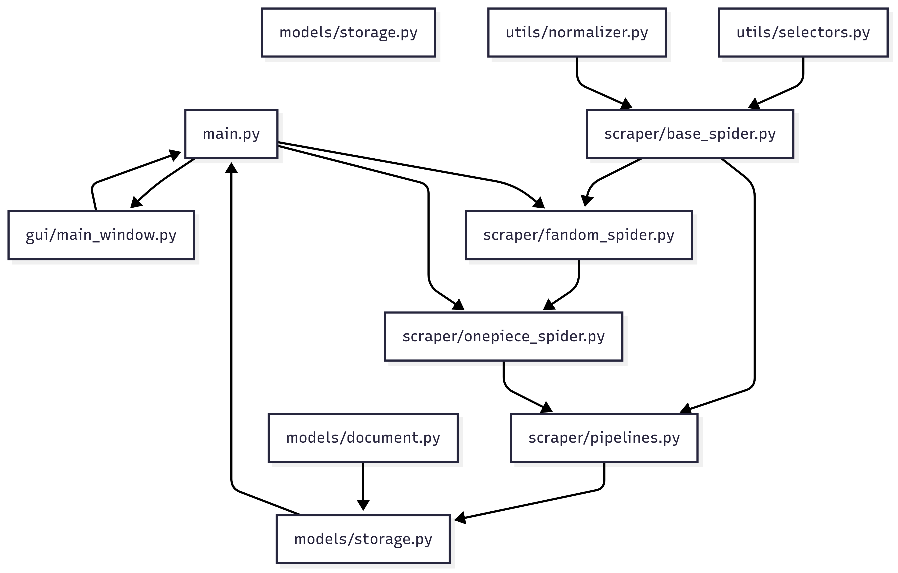
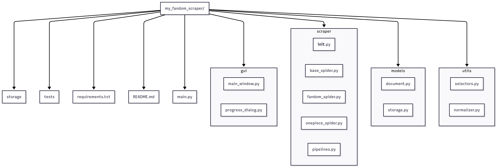
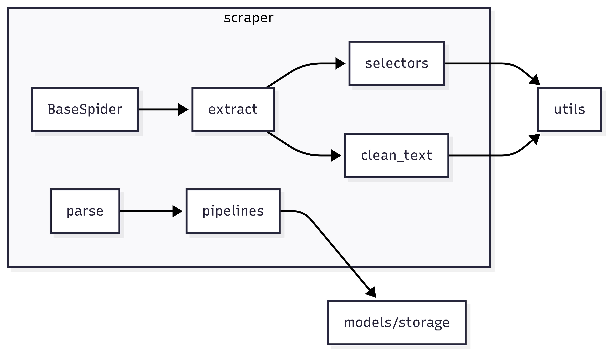
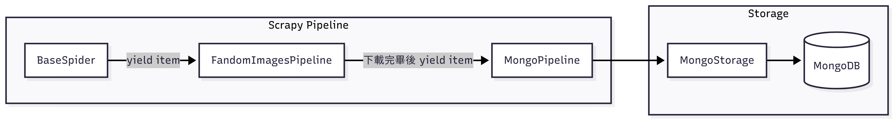

# fandom-gui-scraper

一個抓取動畫相關 Fandom Wiki 並以 PyQt GUI 操作的桌面應用。

## 目錄結構

```bash
my_fandom_scraper/
├── gui/
├── scraper/
├── models/
├── utils/
├── storage/
├── tests/
├── requirements.txt
└── main.py
```

## 目錄結構 update1
```bash
my_fandom_scraper/
│
├── scripts/                   # 放手動跑的 prototype 腳本，不列入正式測試
│   └── prototype_starwars.py  # 最直白的 requests + parsel 示範
│
├── tests/
│   ├── unit/                  # 單元測試
│   │   ├── test_selectors.py  # 只測 get_selector/fallback
│   │   └── test_normalizer.py # clean_text & normalize_date
│   │
│   ├── integration/           # 整合測試
│   │   └── test_starwars.py   # requests + parsel 一次跑多個 selector，檢查 dict 結構
│   │
│   └── manual/                # 半自動、依賴線上網頁的測試（可選擇跑或不跑）
│       └── test_luke_skywalker_live.py
│
├── utils/
│   └── selectors.py
│   └── normalizer.py
│
#…（其他資料夾不變）…=
```

[](https://github.com/justin21523/fandom-gui-scraper)

## 📚 Project Diagrams & Guides

- [Project Setup And Initialize](setup_initialization_and_git.md)
- 
- 
- 
- 
