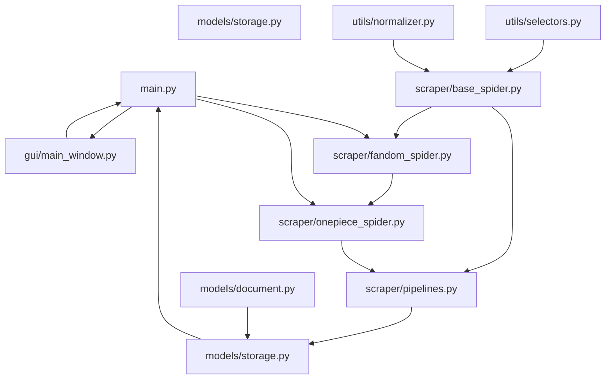

# 專案開發 Roadmap

以下文件為 `fandom-gui-scraper` 專案的完整 8 週開發進度表，包含每週 Milestone、核心任務說明、Git commit 建議，並以 Mermaid 圖示呈現模組與流程依賴關係。

---

## 🗓️ 週次開發進度表 (第 1–8 週)

| 週次 | 主要任務 | 核心說明 | Git Commit 建議 |
| -- | ---- | ---- | ------------- |
|    |      |      |               |

| **Week 1**(第 1 週) | 專案環境與基礎架構初始化          | - 建置 GitHub 倉庫與分支策略 (main/develop)- 撰寫 `requirements.txt`、`README.md`- 建立資料夾結構與空檔案             | `feat: 初始化專案架構，加入 requirements & README`         |
| ----------------- | --------------------- | ---------------------------------------------------------------------------------------------- | ------------------------------------------------ |
| **Week 2**(第 2 週) | `utils/` 模組開發         | - `selectors.py`：設計共用 CSS/XPath selector 管理- `normalizer.py`：欄位標準化、文本清洗- 完成單元測試 (tests/utils)  | `feat: 新增 utils 模組 (selectors, normalizer) 與測試`  |
| **Week 3**(第 3 週) | `models/` 模組開發        | - `document.py`：定義 Pydantic Document schema- `storage.py`：MongoDB 連線與 CRUD 方法- 本地 DB 連線與增刪改查測試 | `feat: 新增 models (document & storage) 並完成 DB 測試` |
| **Week 4**(第 4 週) | `scraper/` — 基礎爬蟲邏輯   | - `base_spider.py`：Scrapy base class- `pipelines.py`：圖片下載、存入 MongoDB- 測試 pipeline 與資料寫入效能      | `feat: 新增 scraper base & pipelines，完成基本儲存`       |
| **Week 5**(第 5 週) | `scraper/` — 通用爬蟲配置   | - `fandom_spider.py`：通用模板 + selector 動態載入- 整合 `utils.selectors` 讀取設定- 撰寫範例測試 (抓取簡易頁面)          | `feat: 新增 fandom_spider，完成通用爬取範例`                |
| **Week 6**(第 6 週) | `scraper/` — 動畫專屬解析   | - `onepiece_spider.py`：One Piece 解析範例- 處理特殊欄位 (人物列表、多媒體)- 撰寫 Mock 資料與測試案例                      | `feat: 新增 onepiece_spider 與對應測試`                 |
| **Week 7**(第 7 週) | `gui/` — PyQt5 GUI 開發 | - `main_window.py`：主視窗布局、信號-slot 設計- `progress_dialog.py`：進度提示與狀態更新- GUI ↔ Scrapy pipeline 介接  | `feat: 完成 GUI 主要視窗與進度條`                          |
| **Week 8**(第 8 週) | 整合、測試與發佈              | - `main.py`：一鍵啟動與 CLI/GUI 切換- 撰寫整合測試 (tests/integration)- 撰寫使用者操作手冊 (Markdown)- Release v0.1.0 | `chore: 完成整合，釋出 v0.1.0`                          |

---

## 🔗 模組依賴關係示意圖

**說明**：

1. **utils/**：提供 selector 與欄位標準化功能，由 `base_spider` 呼叫。
2. **scraper/base\_spider.py**：爬蟲核心，通用邏輯供其他 spider 繼承。
3. **scraper/fandom\_spider.py** 與 **onepiece\_spider.py**：在 base\_spider 基礎上分別處理通用與特定動畫頁面。
4. **pipelines.py**：負責下載圖片、整理資料後呼叫 `models/storage` 儲存至 MongoDB。
5. **models/document.py** 與 **models/storage.py**：定義資料結構與存取邏輯。
6. **main.py**：系統啟動，串接爬蟲與 GUI。
7. **gui/**：PyQt5 介面用於操作、顯示與互動。

---

> 完成此文件後，可放置於專案根目錄下，命名為 `ROADMAP.md`，並於 README 中加上連結，方便團隊檢視與追蹤進度。

