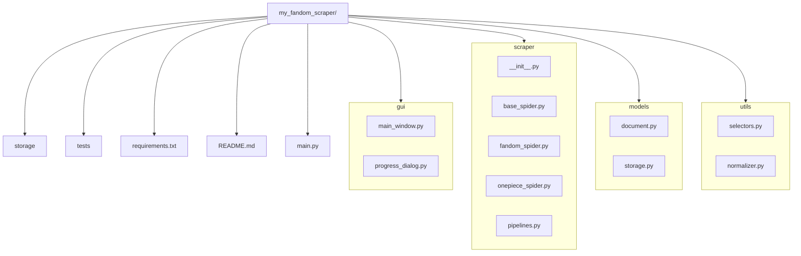

## 建置步驟與範例指令

### 2.1 初始化 Git 倉庫

```bash
# 進到專案根目錄
cd C:\Users\b0979\OneDrive\Document\fandom-gui-scraper

# 初始化 Git
git init

# 設定 main / develop 分支
git checkout -b develop
```

### 2.2 建立 `requirements.txt`

在專案根目錄新增 `requirements.txt`，先放基本套件：

```text
PyQt5>=5.15.4
scrapy>=2.7.0
pymongo>=4.0.1
pydantic>=1.10.2
```

### 2.3 撰寫 `README.md`

在根目錄下建立 `README.md`，示範架構：

````markdown
# fandom-gui-scraper

一個抓取動畫相關 Fandom Wiki 並以 PyQt GUI 操作的桌面應用。

## 目錄結構

```bash
my_fandom_scraper/
├── gui/
├── scraper/
├── models/
├── utils/
├── storage/
├── tests/
├── requirements.txt
└── main.py
````

## 安裝方式

```bash
pip install -r requirements.txt
```

## 開發指南

1. `git checkout develop`
2. 安裝相依：`pip install -r requirements.txt`
3. 啟動 GUI：`python main.py`

### 2.4 建立資料夾與空檔
```bash
mkdir gui scraper models utils storage tests
touch gui/main_window.py gui/progress_dialog.py
touch scraper/__init__.py scraper/base_spider.py scraper/fandom_spider.py scraper/onepiece_spider.py scraper/pipelines.py
touch models/document.py models/storage.py
touch utils/selectors.py utils/normalizer.py
touch main.py requirements.txt README.md

```
#### 若是在terminal執行
```bash
# 逐一建立個目錄
md gui
md scraper
md models
md utils
md storage
md tests
# 建立空檔（File）就用 New-Item -ItemType Fil
# GUI
New-Item gui\main_window.py -ItemType File
New-Item gui\progress_dialog.py -ItemType File

# Scraper
New-Item scraper\__init__.py        -ItemType File
New-Item scraper\base_spider.py     -ItemType File
New-Item scraper\fandom_spider.py   -ItemType File
New-Item scraper\onepiece_spider.py -ItemType File
New-Item scraper\pipelines.py       -ItemType File

# Models
New-Item models\document.py -ItemType File
New-Item models\storage.py  -ItemType File

# Utils
New-Item utils\selectors.py   -ItemType File
New-Item utils\normalizer.py  -ItemType File

# 其他根目錄檔案
New-Item main.py           -ItemType File
New-Item requirements.txt  -ItemType File
New-Item README.md         -ItemType File

```

### 2.5 用 Mermaid 圖示化資料夾結構



## 3. Git Commit 建議

完成以上初始檔案與結構後，進行第一次提交：

```bash
git add .
git commit -m "feat: 初始化專案架構，新增資料夾結構、requirements.txt 與 README.md"
```

---

以下示範一個從零到上線的流程，幫你把本地專案推到 GitHub 上，並完成初步設定：

---

## 1. 在 GitHub 建立新 Repository

1. 登入你的 GitHub 帳號，點右上角的 “＋” → “New repository”
2. Repository name 填 `fandom-gui-scraper`
3. Description（選填）：`桌面版 Fandom Wiki 動畫爬蟲與 PyQt GUI`
4. Visibility：點選 Public（公開）或 Private（私密）
5. 下方 **不要** 搭配自動產生 README／.gitignore（因為你本地已經有）
6. 按 **Create repository**

---

## 2. 在本地加入 Remote、推送分支

打開 VSCode Terminal（或 cmd／PowerShell），確定你目前在專案根目錄 `my_fandom_scraper/`，然後：

```bash
# 1. 新增遠端 origin
git remote add origin https://github.com/<你的帳號>/fandom-gui-scraper.git

# 2. 推送 develop 分支到 origin
git push -u origin develop

# 3. 建立 main 分支，切換並推送
git checkout -b main
git push -u origin main
```

> **解釋**
>
> * `-u origin develop`：第一次推送時把本地 develop 分支和遠端同名分支綁定，以後 `git push`、`git pull` 都會預設到 origin/develop。
> * 為了確保 main 分支是乾淨可發佈的版本，建議先在 develop 做完功能、合併、測試再把 develop 合回 main。

---

## 3. 補齊 `.gitignore` 與 LICENSE（可選，但強烈建議）

1. 在專案根目錄建立 `.gitignore`，加入常見的 Python 忽略項目：

   ```gitignore
   __pycache__/
   *.py[cod]
   .env
   .vscode/
   storage/
   *.sqlite3
   ```

2. （可選）新增一份 LICENSE，例如 MIT：

   ```bash
   curl https://opensource.org/licenses/MIT > LICENSE
   git add .gitignore LICENSE
   git commit -m "chore: 新增 .gitignore 與 LICENSE"
   git push
   ```

---

## 4. 在 GitHub 上做初步設定

1. **Branch protection**

   * 到 Repository → Settings → Branches → Add rule
   * 針對 `main`：

     * 勾選「Require pull request reviews before merging」
     * （選填）「Require status checks to pass before merging」→ 勾選 CI workflow
   * 儲存

2. **README 補連結**

   * 打開 `README.md`，在最上方加一行

     ```markdown
     [](https://github.com/<你的帳號>/fandom-gui-scraper)
     ```
   * `git add README.md && git commit -m "docs: 補上 GitHub Repo Badge" && git push`

---

## 5. 驗證與後續

1. 打開 `https://github.com/<你的帳號>/fandom-gui-scraper`，確認 code、branches 都已上傳。
2. 若要與同事協作，請他們先 fork → clone → `git remote add upstream …` → pull request。
3. 未來可在 GitHub Actions／Travis CI 上接入自動化測試，讓每次 PR 自動跑 `pytest`。

---

以上步驟做完，你的專案就正式部署到 GitHub 上了！之後無論是開新 issue、提交 PR、或自動化 CI，都能順利串接。若有遇到任何問題，再跟我說。
