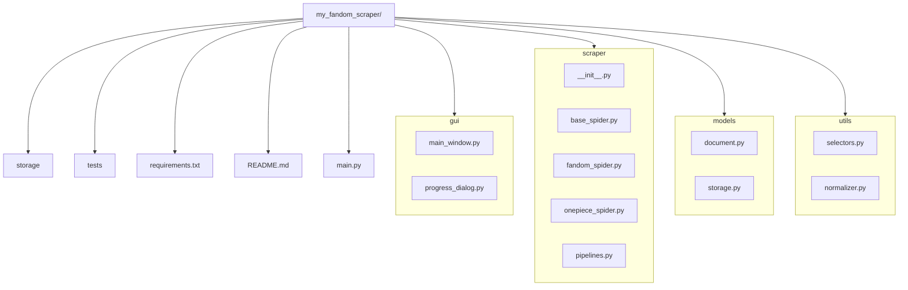

## 建置步驟與範例指令

### 2.1 初始化 Git 倉庫

```bash
# 進到專案根目錄
cd C:\Users\b0979\OneDrive\Document\fandom-gui-scraper

# 初始化 Git
git init

# 設定 main / develop 分支
git checkout -b develop
```

### 2.2 建立 `requirements.txt`

在專案根目錄新增 `requirements.txt`，先放基本套件：

```text
PyQt5>=5.15.4
scrapy>=2.7.0
pymongo>=4.0.1
pydantic>=1.10.2
```

### 2.3 撰寫 `README.md`

在根目錄下建立 `README.md`，示範架構：

````markdown
# fandom-gui-scraper

一個抓取動畫相關 Fandom Wiki 並以 PyQt GUI 操作的桌面應用。

## 目錄結構

```bash
my_fandom_scraper/
├── gui/
├── scraper/
├── models/
├── utils/
├── storage/
├── tests/
├── requirements.txt
└── main.py
````

## 安裝方式

```bash
pip install -r requirements.txt
```

## 開發指南

1. `git checkout develop`
2. 安裝相依：`pip install -r requirements.txt`
3. 啟動 GUI：`python main.py`

### 2.4 建立資料夾與空檔
```bash
mkdir gui scraper models utils storage tests
touch gui/main_window.py gui/progress_dialog.py
touch scraper/__init__.py scraper/base_spider.py scraper/fandom_spider.py scraper/onepiece_spider.py scraper/pipelines.py
touch models/document.py models/storage.py
touch utils/selectors.py utils/normalizer.py
touch main.py requirements.txt README.md

```
#### 若是在terminal執行
```bash
# 逐一建立個目錄
md gui
md scraper
md models
md utils
md storage
md tests
# 建立空檔（File）就用 New-Item -ItemType Fil
# GUI
New-Item gui\main_window.py -ItemType File
New-Item gui\progress_dialog.py -ItemType File

# Scraper
New-Item scraper\__init__.py        -ItemType File
New-Item scraper\base_spider.py     -ItemType File
New-Item scraper\fandom_spider.py   -ItemType File
New-Item scraper\onepiece_spider.py -ItemType File
New-Item scraper\pipelines.py       -ItemType File

# Models
New-Item models\document.py -ItemType File
New-Item models\storage.py  -ItemType File

# Utils
New-Item utils\selectors.py   -ItemType File
New-Item utils\normalizer.py  -ItemType File

# 其他根目錄檔案
New-Item main.py           -ItemType File
New-Item requirements.txt  -ItemType File
New-Item README.md         -ItemType File

```

### 2.5 用 Mermaid 圖示化資料夾結構



## 3. Git Commit 建議

完成以上初始檔案與結構後，進行第一次提交：

```bash
git add .
git commit -m "feat: 初始化專案架構，新增資料夾結構、requirements.txt 與 README.md"
```

---

完成第 1 週的基礎架構搭建後，接下來即可著手進入 **第 2 週：utils 模組開發**。若有任何問題或要微調架構，請隨時提出！
